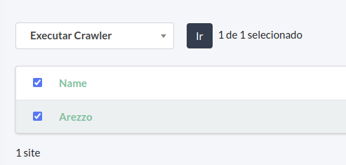
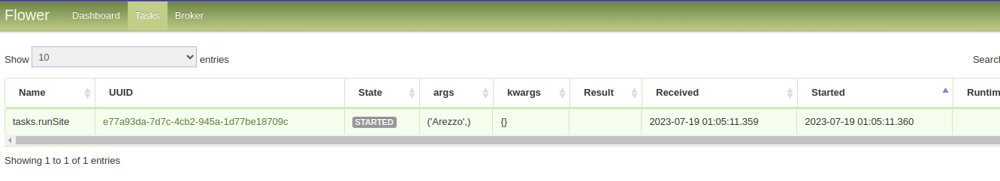
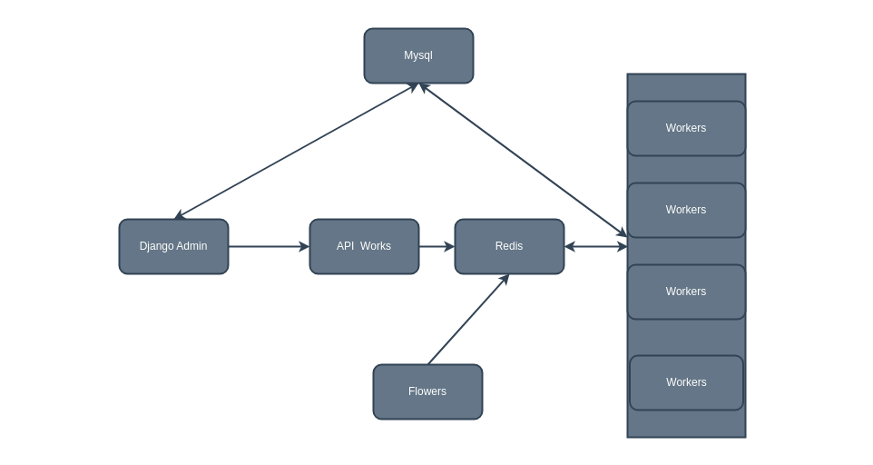

# Crawler System

This project is a simples test of a distributed web crawler system built to ensure scalability, efficiency, and ease of management. 

## Features

- Distributed processing with Celery
- Queue management with Redis
- Web crawler using requests
- Administration interface with Django
- Database management with MySQL
- Comprehensive logging

## Getting Started

Follow these instructions to set up and run the crawler system on your local machine.

### Create a Directory for Docker Volume

This directory will be used to share the files downloaded by the crawler.

```bash
mkdir /home/${USER}/crawler
```

Start Docker Compose
Build and run the Docker containers.
```bash
docker-compose up --build -d
```

Create an Admin User in Django
To create an admin user, you need to access the Django server container.
```bash
docker ps
docker exec -i -t <django_web_container_id> /bin/bash
python manage.py createsuperuser
```

#### Access the Admin Interface
Open your browser and navigate to:
arduino
Copiar código
http://localhost:8000

Add a New Site
After logging into the admin interface, go to the "Sites" tab in the sidebar. Create a new site entry named "Arezzo". This corresponds to the directory containing the extraction logic for the Arezzo site within the crawler directory.
Run the Crawlers
Once a site is registered and has its extraction logic available, you can run the crawler.
<p align="center">

</p>
Monitor Worker Queues
In the admin interface, you can click on "Go to Flowers" to open the monitoring page for the distributed crawler system. This page shows the workers, task queues, and execution history.
<p align="center">

</p>
Complete System Architecture
Below is a schematic representation of the entire system architecture.
<p align="center">

</p>

